# Flashing protopanda

So, since you're here, there are a few things needed to mention before. 
This guide will cover how to setup the environment, how to build, how to flash the firmware and what to put in the SD card.
Currently this guide does not include a way to upgrade stuff from the SD card from an older version to a newer. If you're here for this, consider rewriting the animation.json or other file you modified with your changes. It's planned a tool to auto upgrade in the future, but for now it's completely manual.

## Guides

1) [Setting up the environment](#setting-up-the-environment)   
2) [Compiling and flashing the firmware](#compiling-and-flashing-the-firmware)   
3) [What goes in the SD card](#what-goes-in-the-sd-card)   

# Setting up the environment

Protopanda is written in C++ and designed to be in an Esp32S3 using the arduino framework. For that you'll only need one piece of software and a plugin for that. And MAYBE a driver.

## Step 1 - Software and drivers

First piece of software you need is [Visual Studio Code](https://code.visualstudio.com/download). It's available for both linux and windows.

Once you have it, open and go in the right menu where it says Extensions (or press Ctrl-Shift-X). 
Inside that, search for `pioarduino` and install it.
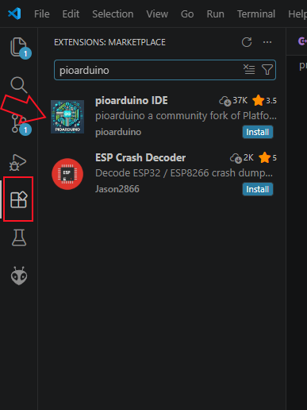

It might take some time to download all files and it might request to restart vs code once.

**Make sure you don't have both platformio and pioarduino at the same time**

## Step 2 - Downloading protopanda

Now you'll go in protopanda page at github, click to download it.

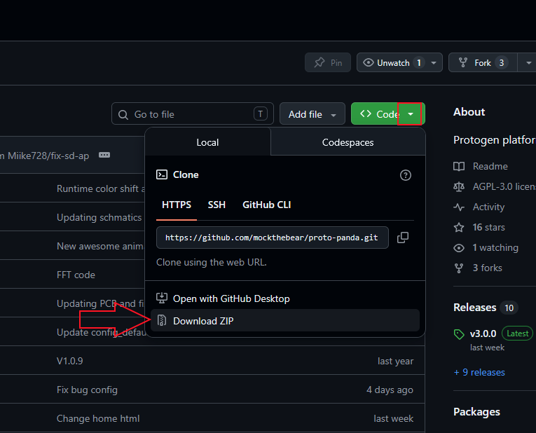

Unzip it somewhere, then go to vs code and select open folder.

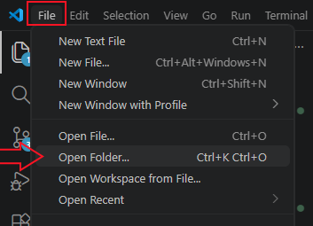

It might ask if you want to download the toolchain and resources for this project, mark yes and wait until it downloads everything.

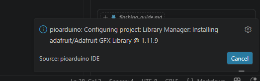

## Step 3 - Plugging the device

If you're using an ESP32S3 board (the DIY route), the board has two USB-C ports, check under the board which one is written "COM". That's the one!

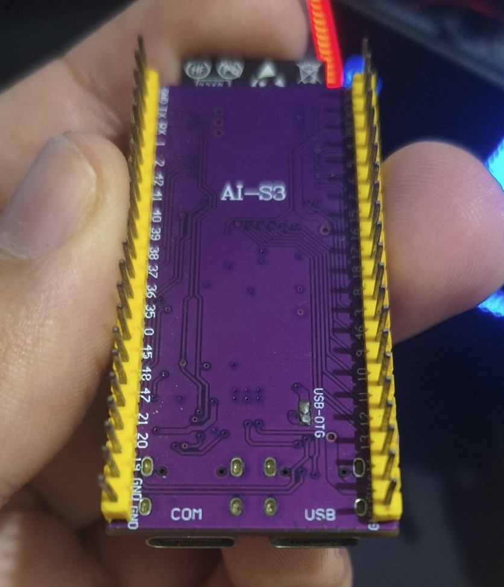

But if you decided to buy an assembled protopanda or did yours using the provided PCB, use the USB-MINI port in front of the controller.

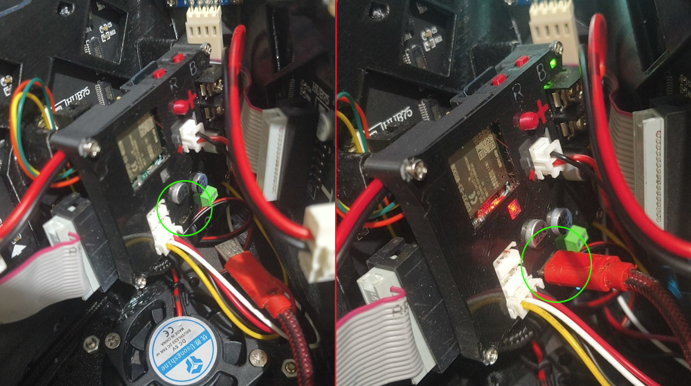

## Step 4 - Drivers?!

Now plug protopanda or the esp32 to your computer. If you get a notice saying "Device unknown" or something like that, it means you might need a driver. 

First of all, depending on which board you're using you might need to download a driver. If you're using a protopanda you bought assembled, it's gonna be a [ch340 driver](https://learn.sparkfun.com/tutorials/how-to-install-ch340-drivers/all). Otherwise it's gonna be another one. **Only download it if it is actually needed!**
Most operational systems already come with most of those drivers or install them automatically for you.

If you don't get any message, you can click in the bottom left icon of a power plug in vs code. That icon is used to select the communication serial port with the device. 

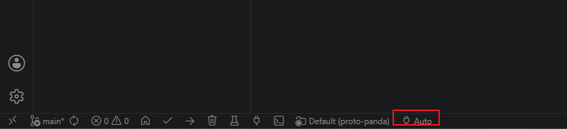

Clicking there a menu will show at the top of the screen.

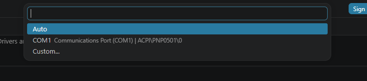

If you see only "COM1" then that means you're cooked and need to install a driver (or the device is not plugged). 
If you see anything like "COM<some number>", then that means you're good, select that one and proceed.

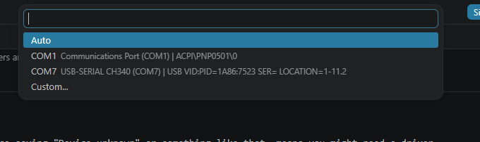

In the scenario of having more than two entries, first unplug the device, check which one is missing then plug again, that's the one.

# Compiling and flashing the firmware

Make sure you completed the setup step previous.

## Compilation

To compile, simply go to the bottom bar, there is a ✅ icon, when you hover the mouse it shows: Build. Click it!

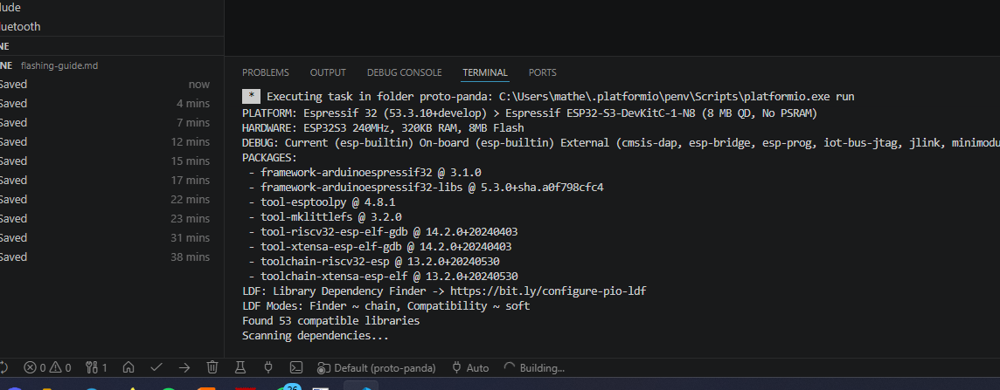

Clicking it will show an embedded terminal at the bottom of vs code.
If it's the first time, it may require that you install more dependencies, which is okay, just do it and wait as a bunch of files show being compiled.

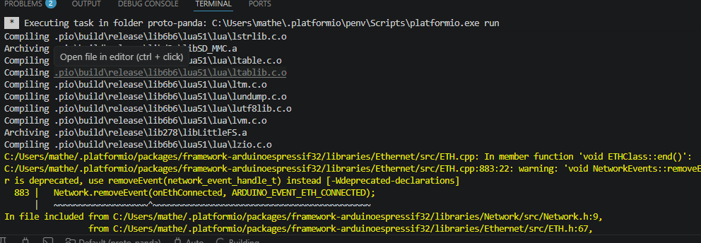

It's okay to show some yellow warning messages.
Once it completes you might see something like this in the terminal:
```
Linking .pio\build\debug\firmware.elf
Retrieving maximum program size .pio\build\debug\firmware.elf
Checking size .pio\build\debug\firmware.elf
Advanced Memory Usage is available via "PlatformIO Home > Project Inspect"
RAM:   [==        ]  20.4% (used 66692 bytes from 327680 bytes)
Flash: [=======   ]  69.6% (used 2188584 bytes from 3145728 bytes)
Building .pio\build\debug\firmware.bin
esptool.py v4.8.1.1
Creating esp32s3 image...
Merged 2 ELF sections
Successfully created esp32s3 image.
```

There you go, you built it!

## Configuration

There is a file in the folder `include/tools/config_defaults.hpp`. There you can change some settings from the project.
If you're building protopanda for a DIY version, you MUST change these two configs:

```cpp
#define PANDA_SD_MODE 2
#define SPI_MAX_CLOCK (80 * 1000 * 1000)
```
Change them to:
```cpp
#define PANDA_SD_MODE 1
#define SPI_MAX_CLOCK (40 * 1000 * 1000)
```
Thats because long wires can cause noise, so the sd card need to run slower. And the SD mode to change from SD_MMC to SPI. Most of the SD card modules out there short two pins to ground, that can make impossible to use the SD_MMC mode, so changing PANDA_SD_MODE to 1, changes back to SPI.

Every time you change something in this file its necessary to recompile and flash the firmware again.

## Flashing

Now you have it built, make sure the device is plugged and you [configured correctly the com port](#step-3---plugging-the-device). If you did it correctly, at the side of the ✅ there is an arrow facing right. Click it!
If it's the first time, it also may request to download some other tool. That's the last one!

You'll see something like this:
```
Checking size .pio\build\release\firmware.elf
Advanced Memory Usage is available via "PlatformIO Home > Project Inspect"
RAM:   [==        ]  20.4% (used 66692 bytes from 327680 bytes)
Flash: [=======   ]  67.0% (used 2106412 bytes from 3145728 bytes)
Configuring upload protocol...
AVAILABLE: cmsis-dap, esp-bridge, esp-builtin, esp-prog, espota, esptool, iot-bus-jtag, jlink, minimodule, olimex-arm-usb-ocd, olimex-arm-usb-ocd-h, olimex-arm-usb-tiny-h, olimex-jtag-tiny, tumpa
CURRENT: upload_protocol = esptool
Looking for upload port...
Auto-detected: COM7
Uploading .pio\build\release\firmware.bin
esptool.py v4.8.1.1
Serial port COM7
Connecting....
```

If everything goes correct you'll see:
```
SHA digest in image updated
Compressed 19728 bytes to 12773...
Writing at 0x00000000... (100 %)
Wrote 19728 bytes (12773 compressed) at 0x00000000 in 0.4 seconds (effective 449.3 kbit/s)...
Hash of data verified.
Compressed 3072 bytes to 144...
Writing at 0x00008000... (100 %)
Wrote 3072 bytes (144 compressed) at 0x00008000 in 0.0 seconds (effective 653.3 kbit/s)...
Hash of data verified.
Compressed 8192 bytes to 47...
Writing at 0x0000e000... (100 %)
Wrote 8192 bytes (47 compressed) at 0x0000e000 in 0.1 seconds (effective 914.8 kbit/s)...
Hash of data verified.
Compressed 2188960 bytes to 1262258...
Writing at 0x00010000... (1 %)
Writing at 0x0001cd16... (2 %)
Writing at 0x00029fbb... (3 %)
Writing at 0x00037e4d... (5 %)
Writing at 0x0003fc5a... (6 %)
Writing at 0x0004811a... (7 %)
Writing at 0x0004dd1f... (8 %)
Writing at 0x00052c60... (10 %)
Writing at 0x0005c4a7... (11 %)
Writing at 0x000685e1... (12 %)
Writing at 0x0007e43d... (14 %)
```

But if you keep seeing:
```
Connecting..................
```
That's probably likely due to the esp not entering correctly in the boot mode. You can force by holding the flash button and then pressing once the reset button at the board.
In case of the assembled protopanda, there are two buttons on the top of the case, the left one is the flash and the right is the reset.

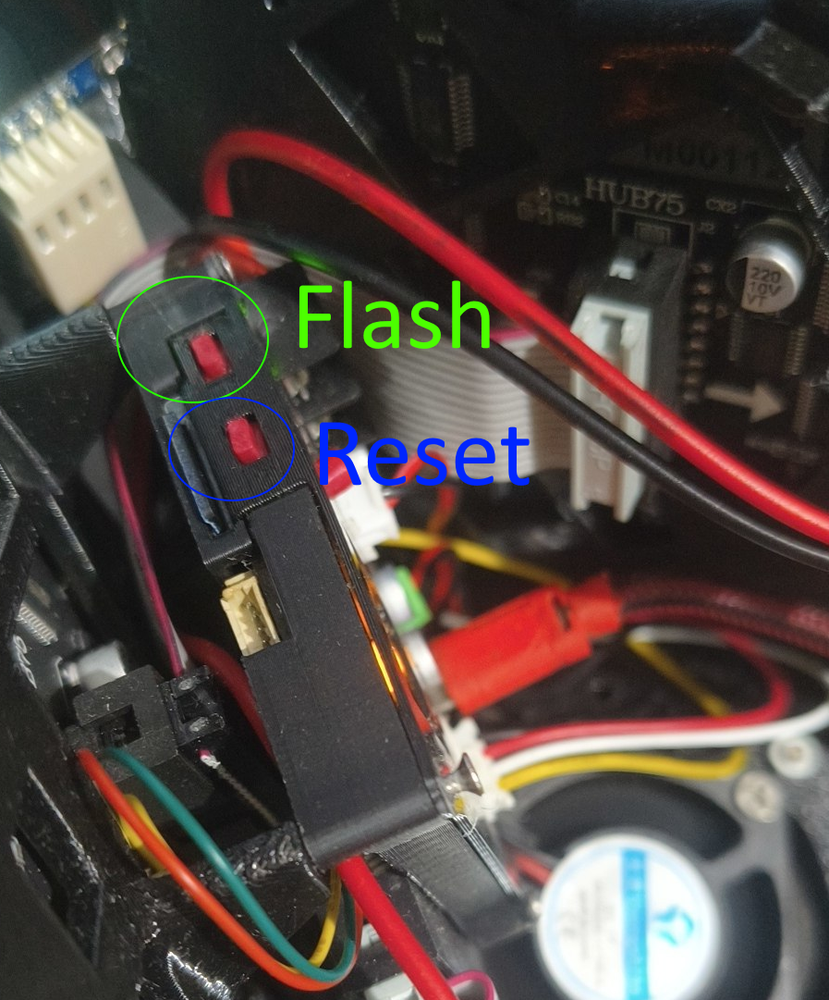

In the esp32 board they're written as "RST" and "BOOT"

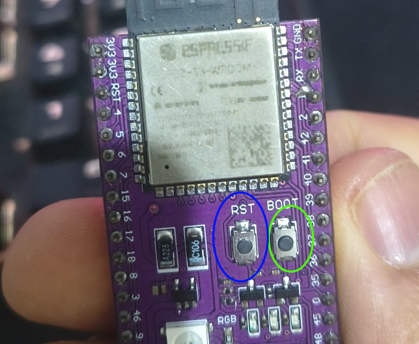

## Reading serial

You can debug and read some serial output that protopanda generates. With the device flashed and connected to the computer, there is a second outlet button, it's named "Serial monitor"

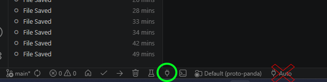

Clicking it, a tab will open and it will show some logs. This is what they look like:

```
--- Terminal on COM7 | 115200 8-N-1
--- Available filters and text transformations: debug, default, direct, esp32_exception_decoder, hexlify, log2file, nocontrol, printable, send_on_enter, time
--- More details at https://bit.ly/pio-monitor-filters
--- Quit: Ctrl+C | Menu: Ctrl+T | Help: Ctrl+T followed by Ctrl+H
ESP-ROM:esp32s3-20210327
Build:Mar 27 2021
rst:0x1 (POWERON),boot:0xa (SPI_FAST_FLASH_BOOT)
SPIWP:0xee
mode:DIO, clock div:1
load:0x3fce2820,len:0x10f0
load:0x403c8700,len:0x4
load:0x403c8704,len:0xbec
load:0x403cb700,len:0x2fcc
entry 0x403c88ac
Starting proto panda v3.0.2!
[241][I] Running I2C Scan...
[244][I] I2C device found at address 60

Starting sd card mode as MMC
[3166][I] [Memory] 85.9% free - 270888 of 315504 bytes free (psram: 8388608 / 8284620  -> 98.8%)
[3222][I] DMA display initialized!
[3238][I] [Memory] memmory_difference msg="Dma display" heap=-125884 psram=-1196
[3254][I] [Memory] 45.9% free - 144868 of 315504 bytes free (psram: 8388608 / 8283424  -> 98.7%)
[3271][I] [Memory] memmory_difference msg="Storage" heap=-152 psram=932
[3287][I] [Memory] 45.8% free - 144588 of 315504 bytes free (psram: 8388608 / 8284356  -> 98.8%)
6[3330][I] Reset reason: Vbat power on reset
[3356][I] [Memory] memmory_difference msg="Devices" heap=-576 psram=0
[3383][I] [Memory] 45.7% free - 144040 of 315504 bytes free (psram: 8388608 / 8284356  -> 98.8%)
[3409][I] Starting FFAT
[3439][I] [Memory] memmory_difference msg="FFAT" heap=-924 psram=-18896
[3465][I] [Memory] 45.4% free - 143140 of 315504 bytes free (psram: 8388608 / 8265460  -> 98.5%)
[3491][I] FFAT totalBytes=10.24 Mb
[3517][I] FFAT usedBytes=0.10 Mb
[3542][I] FFAT Available=99.04%
[3569][I] [Memory] memmory_difference msg="Loaded bulk file" heap=-4368 psram=0
[3595][I] [Memory] 43.9% free - 138356 of 315504 bytes free (psram: 8388608 / 8265460  -> 98.5%)
[4281][I] Completed
[4306][I] [Memory] memmory_difference msg="Frame repo" heap=12 psram=-4888
[4332][I] [Memory] 43.9% free - 138380 of 315504 bytes free (psram: 8388608 / 8260572  -> 98.5%)
[4386][I] [Memory] memmory_difference msg="Lua" heap=-13964 psram=-77992
[4412][I] [Memory] 39.4% free - 124372 of 315504 bytes free (psram: 8388608 / 8182580  -> 97.5%)
[4736][I] [Memory] memmory_difference msg="init.
```


# What goes in the SD card

If you're lazy, copy the whole github repository directly to the sd card.

If you want things clean, this is what you need:

* Folder `scripts`
* Folder `expressions`
* Folder `lualib`
* All `.lua` files at the root
* All `.json` files at the root
* All `.html` files at the root

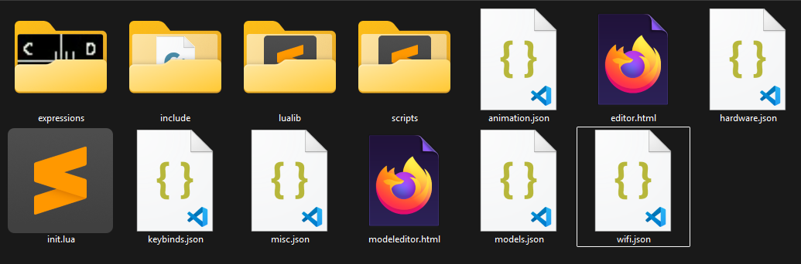